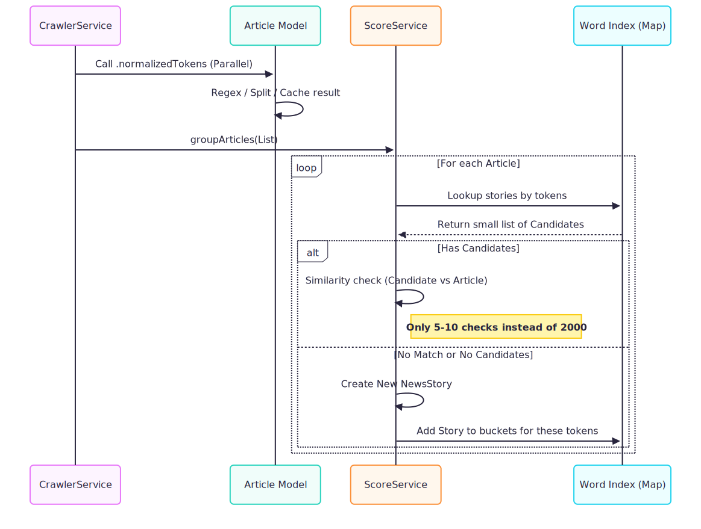

# 📰 News Aggregator Engine

A high-performance Romanian news aggregation system. This engine crawls major news outlets, deduplicates content, and uses an optimized **Inverted Index** similarity algorithm to group related articles into cohesive stories.

## 🚀 Features
- **Parallel Crawling:** Scrapes multiple sources simultaneously using site-specific strategy parsers.
- **Sub-Second Grouping:** Uses a token-bucket strategy to group thousands of articles in seconds, avoiding $O(n^2)$ bottlenecks.
- **Romanian NLP:** Custom normalization for Romanian diacritics and keyword extraction.
- **Local-First Architecture:** Persistent storage using Hive for offline access and instant startup.
- **Firebase Integration:** Secure authentication and cross-device synchronization (In Progress).
- **AI Story Summarization:** Automated "TL;DR" summaries for news groups using LLMs (In Progress).

---

## 🏗 Architecture & Data Flow

The application follows a modular pipeline: **Fetch → Normalize → Index → Group.**

### 1. High-Level Data Pipeline
This flow describes the journey of an article from the source website to the user's screen.

### 2. Grouping & Similarity Logic
To handle 2,000+ articles efficiently, the engine uses an Inverted Index. Instead of comparing every article to every existing story, it only evaluates candidates that share significant keywords.

## 🛠 Tech Stack

| Layer | Technology | Purpose                                    |
| :--- | :--- |:-------------------------------------------|
| **Language** | [Dart](https://dart.dev/) | High-performance, asynchronous core logic  |
| **Database** | [Hive](https://pub.dev/packages/hive) | Lightweight NoSQL local persistence        |
| **Auth** | [Firebase Authentication](https://firebase.google.com/products/auth) | Identity management and secure login       |
| **Sync** | [Cloud Firestore](https://firebase.google.com/products/firestore) | Real-time cloud synchronization (Upcoming) |
| **AI** | [Google Gemini](https://ai.google.dev/) | Narrative summarization (Upcoming)         |
| **Parsing** | `http` & `html` | Low-level scraping and DOM traversal       |

---

## 📂 Key Components

### 📄 Article Model
The core data entity featuring **Lazy Initialization**.
* **`normalizedTokens`**: Sanitizes titles (RegEx stripping, diacritic normalization) only when first accessed.
* **Benefit**: Prevents redundant CPU cycles during intensive grouping loops.

### 🧠 ScoreService
The logic engine responsible for clustering.
* **Inverted Index**: Maps tokens to stories to reduce search space.
* **Jaccard Similarity**: Uses set mathematics to calculate title overlap efficiency.

### ⚙️ CrawlerService
The system orchestrator.
* **Parallel Execution**: Manages multiple parser streams via `Future.wait`.
* **Cache Warming**: Pre-triggers tokenization in parallel before articles reach the grouping phase.

### 🧩 Strategy Parsers
A decoupled collection of site-specific scrapers.
* **Extensibility**: Adding a new source requires zero changes to the core engine; simply implement the `BaseParser` interface.

---

## 🔧 Performance Benchmarks

Based on processing a dataset of **~2,000 articles**:

| Logic Version | Complexity | Execution Time |
| :--- | :--- | :--- |
| **Original Scraper** | $O(n^2)$ | ~60,000 ms (1 min) |
| **Optimized Indexing** | $O(n \log n)$ | **< 2,000 ms (2 sec)** |

> **Note:** Performance gains are achieved by replacing nested loops with hash-map lookups, reducing the number of similarity checks by over 95%.

---

## 🔜 Roadmap

- [ ] **User Accounts**: Firebase Auth implementation for personalized news preferences and profile management.
- [ ] **Bookmarks**: Securely save articles to a "Read Later" cloud-synced list.
- [ ] **AI Summaries**: Integration with Gemini Pro to generate 3-bullet point TL;DRs for grouped story clusters.